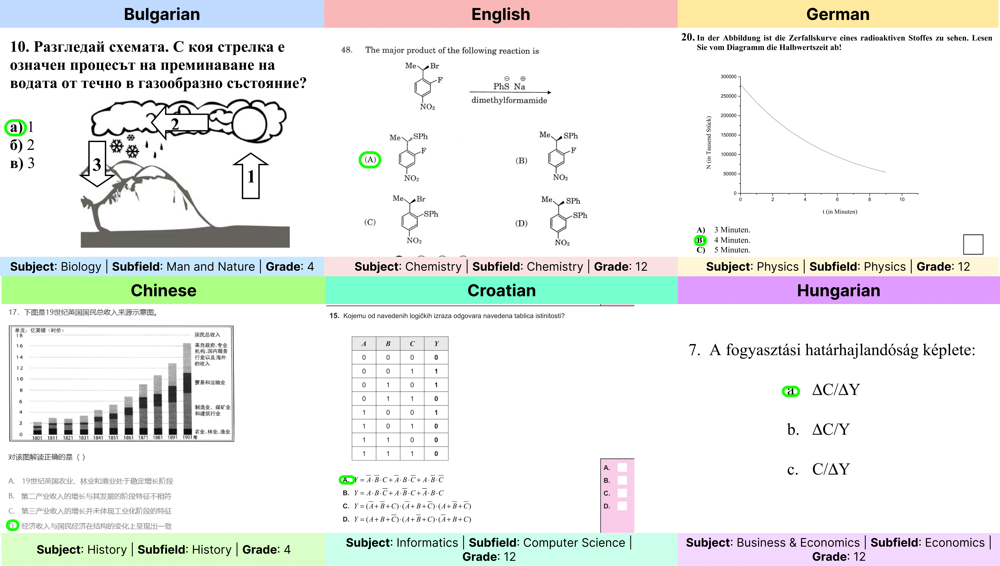

# EXAMS-V: A Multi-Discipline Multilingual Multimodal Exam Benchmark for Evaluating Vision Language Models

[Rocktim Jyoti Das](https://rocktimjyotidas.github.io/), Simeon Emilov Hristov, [Haonan Li](https://haonan-li.github.io/), Dimitar Iliyanov Dimitrov,  [Ivan Koychev](https://scholar.google.com/citations?user=o5YAI9wAAAAJ&hl=en), [Preslav Nakov](https://mbzuai.ac.ae/study/faculty/preslav-nakov/)

Mohamed bin Zayed University of Artificial Intelligence, Abu Dhabi \& Sofia University

This is arxiv link for the EXAMS-V paper can be found [here](https://arxiv.org/pdf/2403.10378.pdf).

## Introduction
We introduce EXAMS-V, a new challenging multi-discipline multimodal multilingual exam benchmark for evaluating vision language models. It consists of  20,932 multiple-choice questions across 20 school disciplines covering natural science, social science, and other miscellaneous studies, e.g.,~religion, fine arts, business, etc. EXAMS-V includes a variety of multimodal features such as text, images, tables, figures, diagrams, maps, scientific symbols, and equations. The questions come in 11 languages from 7 language families. Unlike existing benchmarks, EXAMS-V is uniquely curated by gathering school exam questions from various countries, with a variety of education systems. This distinctive approach calls for intricate reasoning across diverse languages and relies on region-specific knowledge. Solving the problems in the dataset requires advanced perception and joint reasoning over the text and the visual content of the image. 
Our evaluation results demonstrate that this is a challenging dataset, which is difficult even for advanced vision--text models such as GPT-4V and Gemini; this underscores the inherent complexity of the dataset and its significance as a future benchmark.



## Citation
If you find this useful in your research, please consider citing it:
```
@misc{das2024examsv,
      title={EXAMS-V: A Multi-Discipline Multilingual Multimodal Exam Benchmark for Evaluating Vision Language Models}, 
      author={Rocktim Jyoti Das and Simeon Emilov Hristov and Haonan Li and Dimitar Iliyanov Dimitrov and Ivan Koychev and Preslav Nakov},
      year={2024},
      eprint={2403.10378},
      archivePrefix={arXiv},
      primaryClass={cs.CL}
}
```